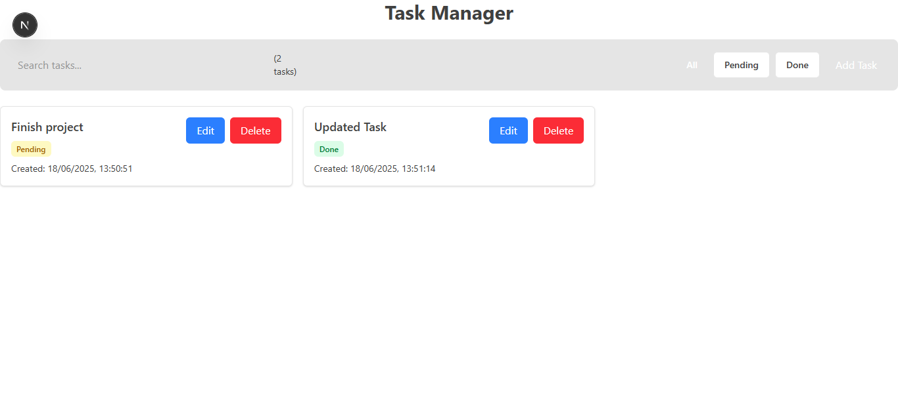
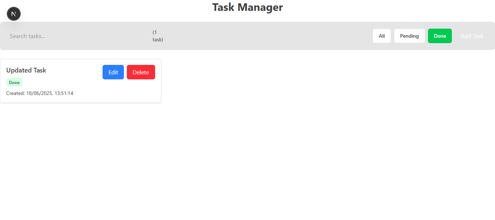

# Mini Task Manager: A Full-Stack Application

 ## Screenshots

### Home Page  


### Task Manager  

---

## Overview
**Mini Task Manager** is a full-stack CRUD task management app built during the **Monk Mantra Software Developer Internship Test**.  
It allows users to create, view, update, and delete tasks with a clean, responsive UI.

- **Frontend**: Next.js with Tailwind CSS.
- **Backend**: Flask (Python) with RESTful APIs.
- **Database**: SQLite (local file).
- **Deployment**: Frontend (optional Vercel), Backend (local for now).

---

## GitHub Repo

- Frontend: Local: [http://localhost:3000]  
- Backend: *Runs locally at* [http://localhost:3001](http://localhost:3001)
- GitHub Repo: *(Optional if public)*

---

## Features

1. **Add Task**: Create new tasks with title and status.
2. **List Tasks**: View all tasks in a card layout.
3. **Update Task**: Edit task title/status.
4. **Delete Task**: Remove tasks with confirmation modal.
5. **Responsive Design**: Fully mobile-friendly layout.
6. **Feedback UI**: Shows loading, error, and empty state messages.

---

## Tech Stack

- **Frontend**: Next.js, Tailwind CSS, React
- **Backend**: Python Flask, Flask-CORS
- **Database**: SQLite
- **API Client**: fetch (native JS)
- **Deployment**: Localhost, with scope to deploy on Vercel/Render

---

## API Endpoints

### GET `/tasks`
- **Description**: Fetch all tasks  
- **Response**:
```
[
  {
    "task_id": 1,
    "task_title": "Finish project",
    "task_status": "pending",
    "created_at": "2025-06-17T12:00:00"
  }
]
````

---

### POST `/tasks`

* **Description**: Create a new task
* **Request Body**:

```
{
  "task_title": "New Task",
  "task_status": "pending"
}
```

* **Response**:

```
{
  "task_id": 2,
  "task_title": "New Task",
  "task_status": "pending",
  "created_at": "2025-06-17T12:05:00"
}
```

---

### GET `/tasks/:id`

* **Description**: Get task by ID
* **Response**:

```
{
  "task_id": 1,
  "task_title": "Finish project",
  "task_status": "pending",
  "created_at": "2025-06-17T12:00:00"
}
```

---

### PUT `/tasks/:id`

* **Description**: Update task title/status
* **Request Body**:

```
{
  "task_title": "Updated Task",
  "task_status": "done"
}
```

* **Response**:

```
{
  "task_id": 1,
  "task_title": "Updated Task",
  "task_status": "done",
  "created_at": "2025-06-17T12:00:00"
}
```

---

### DELETE `/tasks/:id`

* **Description**: Delete a task
* **Response**:

```text
204 No Content
```

---

## UI Features

* **Responsive Design**: Mobile-first grid layout with Tailwind
* **Interactive Elements**: Status filters, delete modals
* **User Feedback**: error alerts

---

## Project Structure

```
frontend/
├── pages/index.js             # Main page rendering TaskList
├── components/
│   ├── TaskForm.js            # Add/Edit task form
│   └── TaskList.js            # Lists tasks with delete/status update
├── styles/globals.css         # Tailwind + custom animation
├── .env.local                 # NEXT_PUBLIC_API_URL=http://localhost:3001

backend/
├── app.py                     # Flask REST API
├── task_manager.db            # SQLite DB
├── api_logs.txt               # Log of all requests
├── venv/                      # Python virtual environment
```

---

## Local Setup

###  Backend

```
cd backend
python -m venv venv
.\venv\Scripts\activate    # For Windows
pip install -r requirements.txt
python app.py              # Starts server on http://localhost:3001
```

###  Frontend

```
cd frontend
npm install
npm run dev                # Runs frontend on http://localhost:3000
```

---


##  Explain Thought Process

###  Why did you choose this project structure?

* The **frontend/backend split** makes it modular and easier to maintain.
* Reusable components (`TaskList`, `TaskForm`) help in code organization.
* Flask + SQLite is lightweight and ideal for internship projects.

### 🔄 How did you separate frontend and backend concerns?

* **Frontend** handles UI, form input, validation, and API calls.
* **Backend** manages data storage, CRUD logic, and error handling.

###  How would you handle errors and edge cases?

* **Frontend**:

  * Handles empty form inputs
  * Shows alerts if API fails
  * Displays “No tasks” if list is empty
* **Backend**:

  * Validates data before insert/update
  * Returns proper status codes (`400`, `404`, `500`)
  * Logs each request into `api_logs.txt`

###  What security features would you add in production?

* Use **HTTPS** for API calls
* **Parameterized queries** to avoid SQL injection (already used in SQLite)
* **Rate limiting** to prevent spamming
* Move secrets and base URLs to `.env`

###  What would you improve if you had 1 full day?

* Add **search bar**, **due dates**, and **sorting** options
* Implement **unit tests** using `unittest` or `Jest`
* Improve UI with **dark mode toggle**
* Move to **PostgreSQL** for production
* Add **user authentication** for private tasks

---

##  Challenges Faced

* API compatibility: Adjusted keys to `task_title` and `task_status` for consistency
* UI delete handling: Added confirmation modal to avoid accidental deletes

---

## License 📄

MIT License - See LICENSE.md for details

---

##  Author

**Kazi Azahar Uddin**
*Software Engineer | Open to work*

* **GitHub**: [KAZI-AZAHAR-UDDIN](https://github.com/KAZI-AZAHAR-UDDIN)
* **LinkedIn**: [Kazi Azahar Uddin](https://www.linkedin.com/in/kazi-azahar-uddin-8b879b205/)

```

